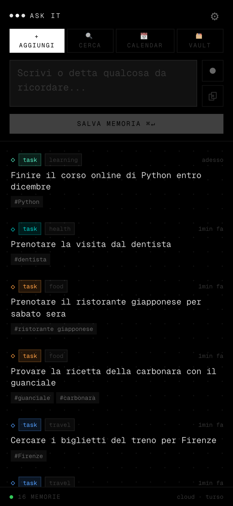
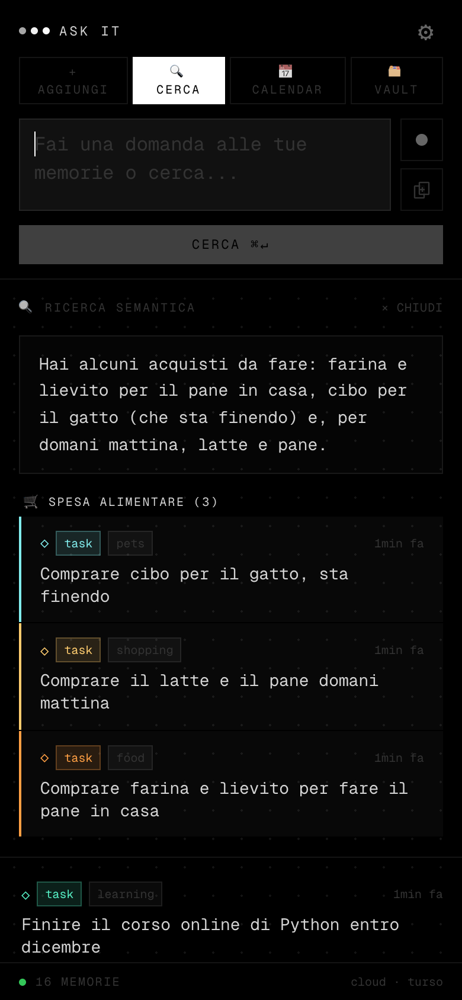
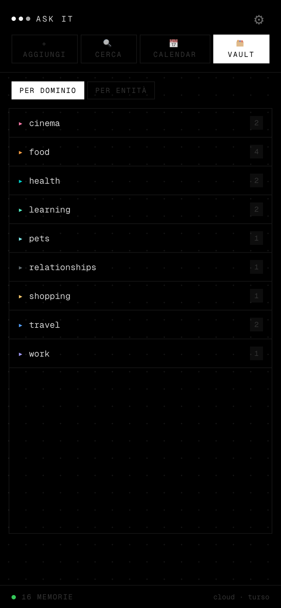
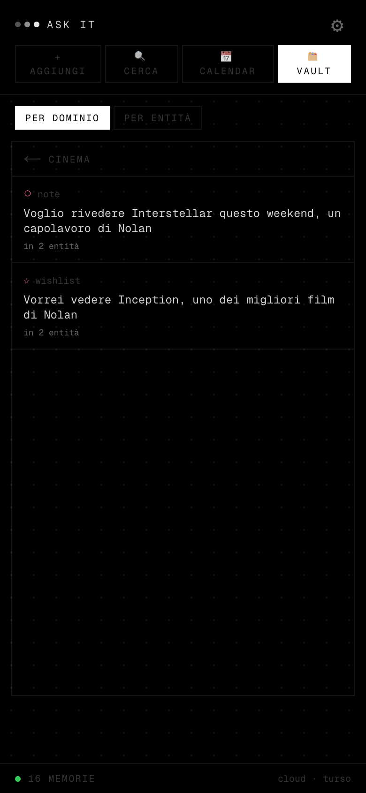
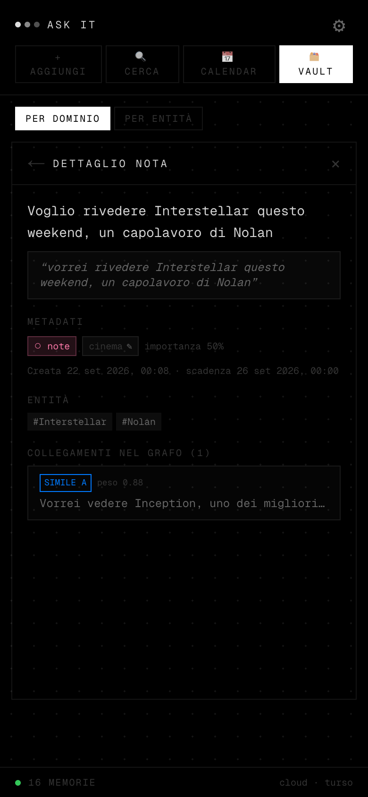
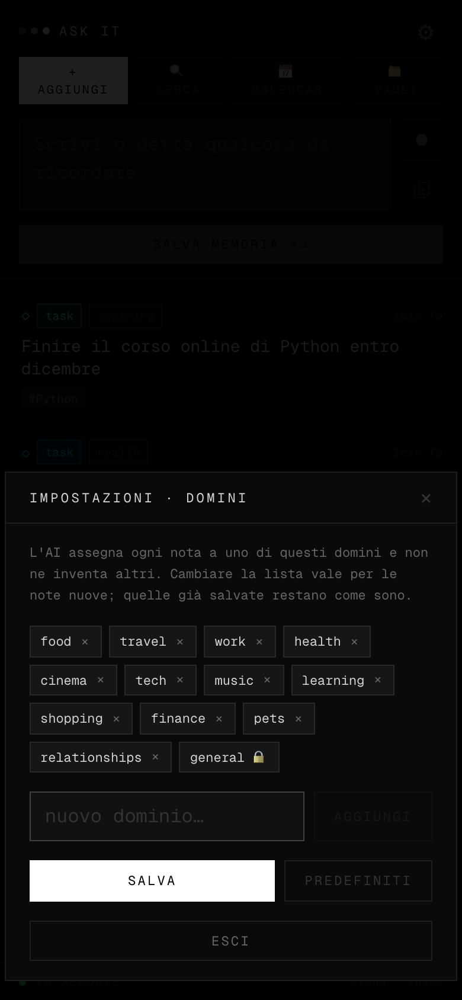

# 🗒️ Ask It

Un blocco note a comando vocale: scrivi o detti appunti veloci, come post-it, senza badare a come; poi glielo chiedi. Lui capisce, ricorda e ritrova. Next.js 16
(App Router), React 19, Turso (SQLite distribuito) su Vercel, Groq per LLM e trascrizione,
embedding via Gemini API.

**Costo di esercizio: 0 €/mese** (tier gratuiti di Vercel, Turso, Groq e Gemini). Le app
commerciali equivalenti chiedono 20-35 €/mese.

---

## 🚀 Cosa fa

- **Cattura vocale** — registri, `whisper-large-v3` su Groq trascrive, il testo viene
  strutturato automaticamente (tipo, dominio, entità, data, importanza).
- **Date relative risolte davvero** — «ricordami di chiamare Marco domani alle 18» diventa un
  timestamp assoluto con fuso orario, e finisce nella vista calendario.
- **Retrieval sul grafo** — la ricerca non manda mai tutte le note al modello: costruisce il
  vicinato rilevante e spedisce solo quello. Il costo per operazione **non cresce** con il
  numero di note (misurato: 252 token con 20 note, 253,6 con 200).
- **Grafo della conoscenza** — le note si collegano fra loro per entità condivise, similarità
  semantica e, opzionalmente, relazioni ragionate dal modello (`DUPLICATES`, `CONTINUES`,
  `CONTRADICTS`, `RELATES_TO`).
- **Domini a lista controllata** — l'AI assegna ogni nota a uno dei domini configurati (default: food, travel, work…) e non ne inventa altri, così le cartelle del Vault non si frammentano (`cibo`/`food`/`cucina`). La lista si modifica dall'ingranaggio in alto (`/api/settings`); fuori lista → `general`.
- **Post-it prima, domande dopo** — su *Aggiungi* ogni testo viene salvato come nota, senza
  eccezioni; le domande si fanno su *Cerca*.
- **Archivia, non solo elimina** — swipe a destra sulla nota: corto = modifica, lungo e tenuto =
  archivia (o ripristina, dall'elenco «archiviate»). Swipe a sinistra lungo = elimina per
  sempre. Le archiviate spariscono da lista, calendario, Vault e ricerca ma restano salvate.
- **Estetica Nothing Phone** — dark mode ad alto contrasto, dot-grid.

---

## 📸 Screenshot

Dati di esempio, interfaccia mobile (l'app è pensata per il telefono).

| Home | Ricerca | Vault |
| :---: | :---: | :---: |
|  |  |  |
| Lista delle memorie, tipo e dominio assegnati dall'AI | La risposta cita solo le note recuperate dal grafo | Cartelle per dominio |

| Elenco note | Dettaglio e grafo | Impostazioni |
| :---: | :---: | :---: |
|  |  |  |
| Note di un dominio | Entità e archi verso le note simili, con peso | Lista domini modificabile |

---

## 🏗️ Come funziona il retrieval

Il punto centrale del progetto. Quattro generatori di candidati girano **in locale, a costo
zero token**; solo i sopravvissuti alla fusione vedono l'LLM.

```
              query o nota nuova
                      │
      ┌───────────────┼───────────────┬───────────────┐
      ▼               ▼               ▼               ▼
 ① ancore        ② espansione     ③ kNN          ④ FTS5
   entità          sul grafo       vettoriale      lessicale
      │               │               │               │
      └───────────────┴───────┬───────┴───────────────┘
                              ▼
                  fusione RRF · taglio a 12 nodi
                              ▼
                          prompt LLM
```

Ogni risultato porta la propria *provenance* (quale generatore l'ha trovato e a che rank), utile
quando un risultato sorprende.

---

## 🛠️ Stack

- **Frontend**: React 19, Tailwind CSS v4, Geist Mono
- **Hosting**: Vercel (funzioni serverless, regione `dub1`/Dublino)
- **Database**: Turso (libSQL/SQLite distribuito) via `@libsql/client`, con FTS5 per la ricerca
  lessicale. In locale, stesso client punta a un file `.db` — nessuna differenza di codice fra
  sviluppo e produzione, solo le variabili d'ambiente cambiano (vedi §Avvio)
- **LLM**: Groq SDK — `qwen/qwen3.8-27b` per parsing e ricerca, `openai/gpt-oss-120b` per il
  linking ragionato (opzionale), `whisper-large-v3` per la trascrizione
- **Embedding**: Gemini API (`gemini-embedding-001`, 768 dim, multilingue). Una chiamata HTTP per
  nota, nessun modello locale — scelta fatta dopo che gli embedding locali (transformers.js +
  onnxruntime-node) si sono rivelati impossibili da impacchettare in modo affidabile su Vercel
  (dettagli in `PIANO.md` §9)

```
askit/
├── src/
│   ├── app/
│   │   ├── api/
│   │   │   ├── items/        # CRUD memorie (GET, PUT, PATCH, DELETE) + items/[id]
│   │   │   ├── parse/        # analisi, salvataggio, embedding, archi
│   │   │   ├── search/       # retrieval sul grafo + risposta LLM
│   │   │   ├── settings/     # lista domini modificabile
│   │   │   ├── tree/         # note raggruppate per dominio/entità (vista Vault)
│   │   │   ├── reindex/      # ricalcolo archi + embedding mancanti, gratis
│   │   │   ├── reanalyze/    # ri-parsing LLM in batch, rate-limited
│   │   │   └── transcribe/   # audio -> testo
│   │   ├── globals.css
│   │   ├── layout.tsx
│   │   └── page.tsx
│   ├── components/           # MemoryCard, EditModal, DuplicateModal, VaultView, NoteDetail, SettingsModal, types
│   └── lib/
│       ├── db.ts             # client Turso/libSQL, migrazioni, entità
│       ├── embed.ts          # embedding via Gemini API
│       ├── graph.ts          # archi item<->item
│       ├── groq.ts           # chiamate LLM
│       ├── settings.ts       # impostazioni utente (lista domini)
│       ├── retrieve.ts       # i 4 generatori + fusione RRF
│       ├── tfidf.ts          # duplicati lato client
│       ├── temporal.ts       # date relative -> assolute
│       └── vector.ts         # cosine similarity
├── scripts/
│   ├── backfill-embeddings.mjs
│   ├── rebuild-graph.mjs
│   └── seed-synthetic.mjs    # corpus sintetico per i benchmark
└── PIANO.md                  # progetto del refactor, con le misure
```

---

## 💾 Schema

| Tabella | Scopo | Colonne principali |
| :--- | :--- | :--- |
| **`items`** | Le memorie | `id`, `content`, `raw_text`, `type`, `domain`, `importance`, `usage_count`, `time_ref` |
| **`entities`** | Nodi entità | `id`, `name`, `normalized_name`, `type` |
| **`item_entities`** | Legami M-N | `item_id`, `entity_id`, `confidence` |
| **`edges`** | Archi del grafo | `source_id`, `target_id`, `edge_type`, `weight` — `MENTIONS`, `CO_OCCURS`, `SIMILAR_TO`, e i tipi ragionati |
| **`embeddings`** | Vettori | `owner_id`, `vector` (768 float, Gemini), `model`, `dim` |
| **`items_fts`** | Indice FTS5 | tabella virtuale external-content su `items` |

---

## 🚀 Avvio

### 1. Requisiti
Node.js 18+ e npm.

### 2. Variabili d'ambiente
Crea `.env.local`:

```env
GROQ_API_KEY=la_tua_chiave       # console.groq.com
GEMINI_API_KEY=la_tua_chiave     # aistudio.google.com, per gli embedding
ASKIT_PASSWORD=una-password-lunga # obbligatoria in produzione (vedi «Accesso» sotto)

# opzionali
TURSO_DATABASE_URL=              # se assente, usa un file SQLite locale
TURSO_AUTH_TOKEN=
ASKIT_TIMEZONE=Europe/Rome           # fuso per risolvere le date relative
ASKIT_REASONED_LINKING=0             # 1 per attivare gli archi ragionati (vedi sotto)
ASKIT_DB_PATH=                       # per puntare a un file DB diverso (benchmark)
```

Senza `TURSO_DATABASE_URL`/`TURSO_AUTH_TOKEN` l'app usa un file `askit.db` locale — stesso
codice, comportamento identico in sviluppo e in produzione (vedi `PIANO.md` §9.3).

### Accesso

L'app è protetta da una sola password, `ASKIT_PASSWORD`: senza, chi conosce l'indirizzo può
leggere e cancellare le note e consumare le quote di Groq/Gemini. Il login (`/login`) imposta un
cookie di un anno, rinnovato a ogni visita; il controllo è sia nel `proxy.ts` (reindirizza al login) sia dentro ogni
route API (è lì che stanno i dati). **In produzione, senza `ASKIT_PASSWORD` l'app risponde 503**
a tutto invece di restare aperta; in sviluppo (`npm run dev`) il controllo è spento. Cambiare la
password disconnette tutte le sessioni. Usane una lunga: il tentativo sbagliato è solo rallentato.

### 3. Installazione e avvio

```bash
npm install
npm run dev
```

### 4. Deploy (Vercel + Turso)

Collega il repo a Vercel (auto-deploy su push a `main`), imposta le stesse variabili
d'ambiente nel progetto Vercel. Dettagli e insidie reali (limite funzioni serverless,
regione del database, cache in sola lettura) in `PIANO.md` §9.

### 5. Se hai già un database

```bash
npm run embeddings:backfill   # genera i vettori mancanti
npm run graph:rebuild         # costruisce gli archi item<->item
```

---

## ⚙️ Limiti del free tier Groq

| Limite | Valore | Conseguenza |
| :--- | :--- | :--- |
| Richieste/minuto | 30 | mai raggiunto in uso personale |
| Token/minuto | 8.000 | il retrieval sul grafo tiene il contesto a ~250 token |
| **Output token/minuto** | **1.000** | il più stringente: `max_tokens` è una *prenotazione* contro questo limite, non solo un tetto |
| Token/giorno | 200.000 | ~135 operazioni al giorno |

Per questo `ASKIT_REASONED_LINKING` è disattivato di default: i token di reasoning contano
sull'OTPM, e il parsing di una nota ne prenota già 500. `CO_OCCURS` e `SIMILAR_TO` producono
comunque un grafo utilizzabile a costo zero.

---

## 🧪 Benchmark

Il criterio di progetto è che il costo del retrieval non dipenda dalla dimensione del corpus:

```bash
sqlite3 askit.db "VACUUM INTO '/tmp/bench.db'"
ASKIT_DB_PATH=/tmp/bench.db node scripts/seed-synthetic.mjs 200
ASKIT_DB_PATH=/tmp/bench.db node scripts/rebuild-graph.mjs
# poi punta l'app a /tmp/bench.db e interroga /api/search con {"dryRun": true}
```

---

## 📄 Licenza

[MIT](LICENSE) © 2026 Roberto Biagetti
